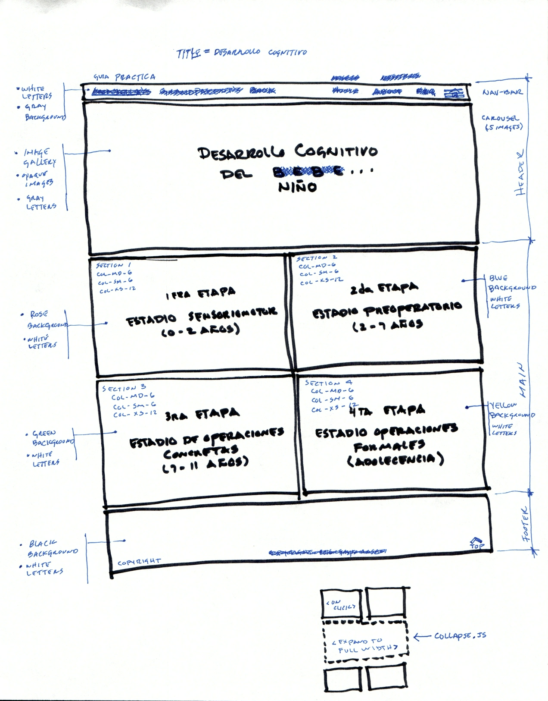

### Desarrollo Cognitivo

```
Codetrotters Intro to Web Development Fall 2016
Final Project web Page
December 14, 2016
Arturo Santiago-Rivera
```

El proyecto de pagina Web aqui desarrollado, esta motivado en el aprendizaje del desarrollo del pensamiento de mis nietas, Anabella y Vianca, según la teoría del desarrollo cognitivo, o tambien llamado desarrollo cognoscitivo,


<br />Figure 1: Scan Project Conceptual Wireframe
